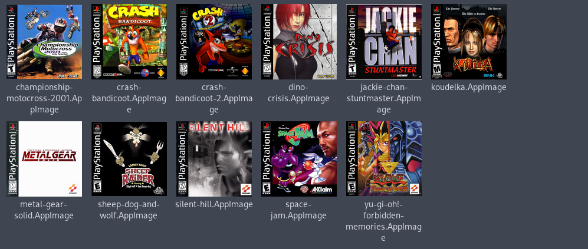
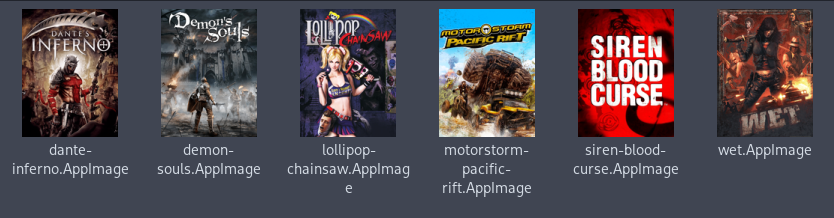
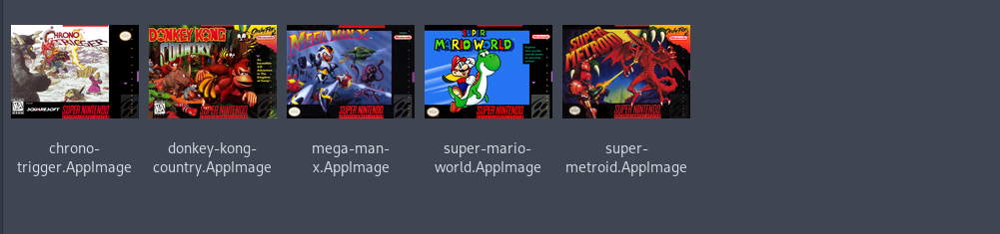

# Agape - AppImage Game Packer

[[_TOC_]]

Game emulation is on the rise, with years of contribution from the community and
now with Valve's portable handheld, the `steam deck`. The fragmentation with
several platform emulators is daunting, especially since it requires repetitive
configuration for the first time or if the config files go missing. Agape is a
tool to pack a runner (such as an emulator), a game, and it's configs in a
single `appimage` package.

## Supported applications for packaging

<a href="https://www.retroarch.com/" target="_blank">
  
</a>

<a href="https://pcsx2.net/" target="_blank">

</a>

<a href="https://rpcs3.net/" target="_blank">

</a>

## Install

Clone the repository and start the application with `./src/main.sh`.

## Usage

Agape requires a directory set-up with the required files for the target
platform, `./src/main.sh` displays the following example:

```
-- Usage:
  main.sh --name="game name" --dir=src-directory --boot=startup-file
  - "game name": The name of the game.
  - "src-directory": The directory with the bios, rom, etc. May be absolute or relative.
  - "startup-file": The name (not the path) of the file inside the
                    rom folder to start by default, i.e., you can choose
                    'disc 1' to start by default, use the PUP file for rpcs3.
  The source directory must have this structure (files can have any name):
    src-directory
    ├─rom
    │ ├─rom-disc-1.[bin,cue,wbfs,...]
    │ ├─rom-disc-2.[bin,cue,wbfs,...]
    │ ├─...
    │ └─rom-disc-n.[bin,cue,wbfs,...]
    ├─core # for retroarch
    │ └─core.so
    ├─bios # for retroarch (psone), pcsx2, rpcs3
    │ └─bios.[bin,PUP]
    └─icon
      └─icon.[png,svg,jpg]
```

---

<details>
<summary>rpcs3 example</summary>

For `rpcs3` you can set up:

```
my-game-dir
├── bios
│   └── bios.PUP
├── icon
│   └── my-game-cover.png
└── rom
    ├── PS3_DISC.SFB
    └── PS3_GAME
```

and run:
```
./src/main.sh --platform=rpcs3 \
   --name="My cool game" \
   --dir=./my-game-dir \
   --boot="PS3_DISC.SFB"
```
</details>

---

<details>
<summary>pcsx2 example</summary>

Similarly for `pcsx2`:

```
my-game-dir
├── bios
│   └── my-ripped-bios.bin
├── icon
│   └── my-game-cover.jpg
└── rom
    └── my-game.iso
```

and run:
```
./src/main.sh --platform=pcsx2 \
  --name="My cool game" \
  --dir=./my-game-dir
  --boot="my-game.iso"
```
</details>

---

<details>
<summary>retroarch example</summary>

And for `retroarch`:

```
my-game-dir
├── bios
│   └── my-ripped-bios.bin
├── core
│   └── swanstation_libretro.so
├── icon
│   └── my-game-cover.png
└── rom
    ├── my-game-disc-1.bin
    ├── my-game-disc-1.cue
    ├── my-game-disc-2.bin
    ├── my-game-disc-2.cue
    ├── my-game-disc-3.bin
    ├── my-game-disc-3.cue
    ├── my-game-disc-4.bin
    └── my-game-disc-4.cue
```

and run:

```
./src/main.sh --platform=retroarch \
  --name="My cool game" \
  --dir=./my-game-dir
  --boot="my-game-disc-1.cue"
```

This defaults the disc 1 to start with the appimage, you can open retroarch
interface with `F1` or other key you configured it with. And change discs in
there. Remove the `bios` folder for platforms that do not require it.
</details>

---

## Showcase

Files displayed on the `thunar` file manager.






## Tutorial on how to show icons for generated AppImages


The following methods use thunar, other supported file managers are listed
<a href="https://github.com/linuxmint/xapp-thumbnailers" target="_blank">here</a>. Note that the `appimage` must be set as executable for the thumbnail generation.

<details>
<summary>Automatic Method</summary>
Execute the install script:

```sh
curl https://gitlab.com/formigoni/agape/-/raw/master/thumbnailer/install.sh | bash
```
</details>

<details>
<summary>Manual Method</summary>

1. Install the required packages
  - `sudo apt install tumbler squashfs-tools thunar`
  - `sudo pacman -S tumbler squashfs-tools thunar`

2. Copy the thumbnailer files
  - `sudo cp thumbnailer-appimage /usr/bin`
  - `sudo chmod +x /usr/bin/thumbnailer-appimage`
  - `mkdir -p ~/.local/share/thumbnailers`
  - `cp appimage.thumbnailer ~/.local/share/thumbnailers`

3. Allow icons on files over 2GB
  - `mkdir -p ~/.config/tumbler`
  - `cp /etc/xdg/tumbler/tumbler.rc ~/.config/tumbler/`
  - `awk -i inplace '/\[DesktopThumbnailer\]/,/MaxFileSize=(.*)/ { sub("MaxFileSize=.*", "MaxFileSize="); } 1' ~/.config/tumbler/tumbler.rc`

</details>

---

> Disclaimer: This project does not endorse piracy, buy your games and console
> to use this software.
