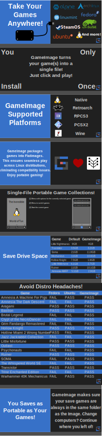
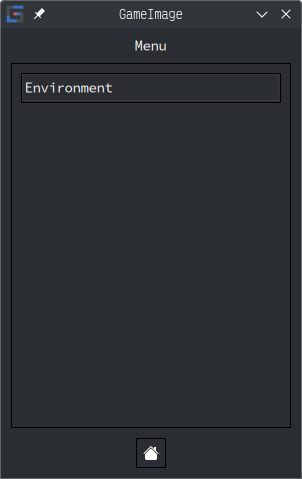
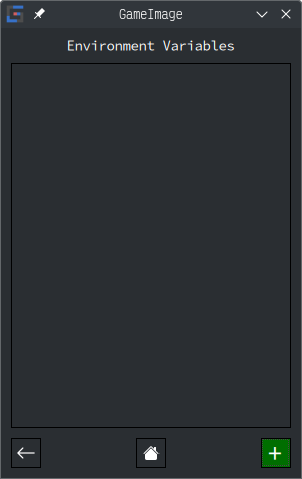
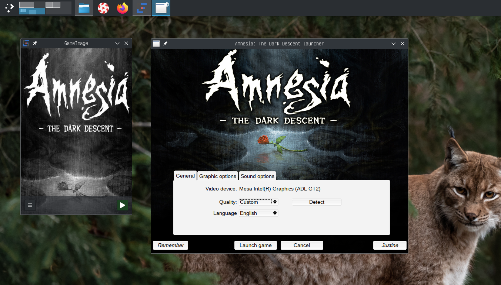

<div align="center">
  
</div>

# GameImage - FlatImage Game Packer

- [GameImage - FlatImage Game Packer](#gameimage---flatimage-game-packer)
  - [About](#about)
  - [Supported Package Types](#supported-package-types)
  - [Showcase](#showcase)
  - [Install](#install)
  - [Tutorials](#tutorials)
  - [FlatImage](#flatimage)
  - [Known Issues](#known-issues)

## About

https://github.com/ruanformigoni/gameimage/assets/18180693/7690e65a-aed9-4bfa-aa98-3ffd57e20e65

---



Game emulation is on the rise, with years of contribution from the community and
now with Valve's portable handheld, the `steam deck`. The fragmentation with
several platform emulators is daunting, especially since it requires repetitive
configuration for the first time or if the config files go missing. GameImage is
a tool to pack a runner (such as an emulator), a game, and it's configs in a
single `flatimage`.

Advantages:

- [x] Simplicity:
  - [x] No need to install an emulator or wine to run your games,
      they are downloaded as images and packaged with the game.
  - [x] Each game config/saves are in the same folder as the `flatimage` by
      default, which simplifies backups.
- [x] Usability: get your game running with a double click on a fresh linux
    install, no dependencies required.
- [x] Storage: Smaller file sizes than loose files, since the images uses a compressed filesystem.

## Supported Package Types

<a href="" target="_blank">
  
</a>

<a href="https://www.retroarch.com/" target="_blank">
  
</a>

<a href="https://pcsx2.net/" target="_blank">

</a>

<a href="https://rpcs3.net/" target="_blank">

</a>

<a href="https://www.winehq.org/" target="_blank">

</a>

## Showcase

<a href="" target="_blank"></a>
<a href="" target="_blank"></a>
<a href="" target="_blank"></a>



## Install

Download the latest `gameimage.run` file in the [releases](https://github.com/ruanformigoni/gameimage/releases) page.

https://github.com/ruanformigoni/gameimage/assets/18180693/208c41dd-2454-484a-a30f-8b711e94b41b

[download video](https://github.com/ruanformigoni/gameimage/raw/master/doc/video/tutorial-download.mp4)

## Tutorials

### Wine Single

https://github.com/ruanformigoni/gameimage/assets/18180693/0592dd5f-9b27-4503-9978-77842ad4c7b6

[download video](https://github.com/ruanformigoni/gameimage/raw/master/doc/video/tutorial-wine.mp4)


### Wine Multiple

https://github.com/ruanformigoni/gameimage/assets/18180693/a2d92de2-ce28-4c7b-9f25-02eb9db525da

[download video](https://github.com/ruanformigoni/gameimage/raw/master/doc/video/tutorial-wine-multi.mp4)

### Linux

https://github.com/ruanformigoni/gameimage/assets/18180693/b5ad407e-23a6-48fd-b636-c2ef2a89fd28

[download video](https://github.com/ruanformigoni/gameimage/raw/master/doc/video/tutorial-linux.mp4)

## FlatImage

The key advantages of flatimage are:

1. Flatimage packs everything the application requires to run in a single file.
1. Subsequently, the generated file works on linux distributions without,
   expecting any libraries to be available on the host.
1. Flatimage runs the application on a containerized environment, it only allows the application
   to access what is necessary for it to work (such as sockets and devices).
1. Flatimage is read-write, you can create a flatimage that stores your saves in
   the image itself, that way, instead of having back-up one file
   (wine+prefix+game data) and one directory (saves), you just have to backup
   one file. Flatimage grows automatically to accomodate your save data, you can
   still use the previous method with flatimage, as well as others listed in 

## Known Issues

### General

Avoid using `NTFS` formatted hard-drives.

### Ubuntu 24.04

Recent changes to [apparmor](https://gitlab.com/apparmor/apparmor) requires to
create the file `/etc/apparmor.d/bwrap` with the contents:

```apparmor
# This profile allows everything and only exists to give the
# application a name instead of having the label "unconfined"

abi <abi/4.0>,
include <tunables/global>

profile bwrap /**/bwrap flags=(unconfined) {
  userns,
}
```

Lastly run `sudo systemctl reload apparmor` to reload the configuration files.

---

> Disclaimer: This project does not endorse piracy, buy your games and console
> to use this software.
