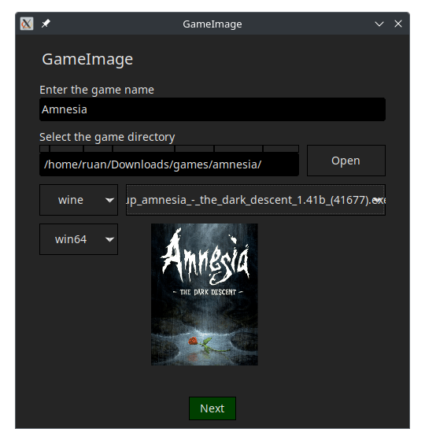
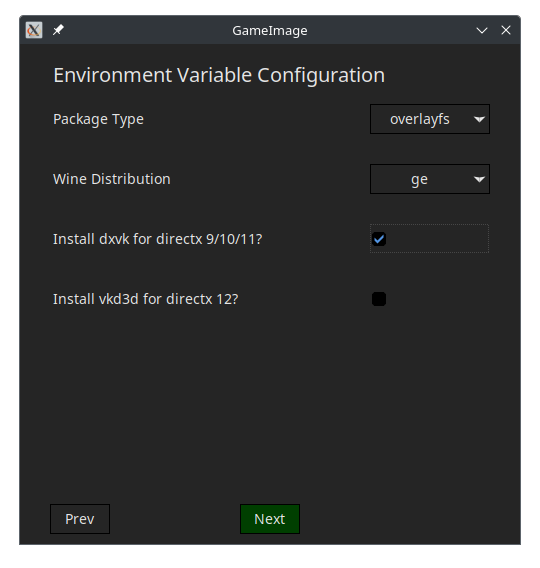
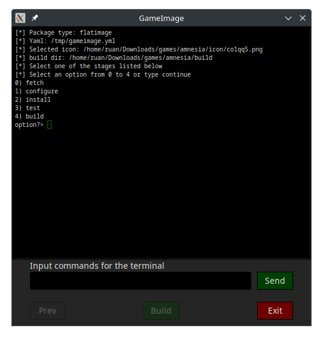
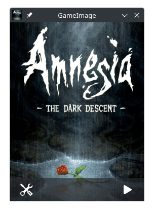
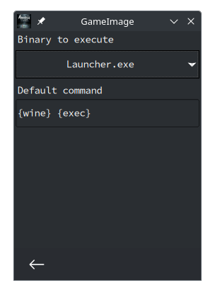

<div align="center">
  
</div>

# GameImage - FlatImage / AppImage Game Packer

- [GameImage - FlatImage / AppImage Game Packer](#gameimage---flatimage-/-appimage-game-packer)
  - [Supported applications for packaging](#supported-applications-for-packaging)
  - [Showcase](#showcase)
  - [Graphical User Interface (GUI)](#graphical-user-interface-gui)
    - [GUI Installer](#gui-installer)
    - [GUI Launcher](#gui-launcher)
  - [Dependencies](#dependencies)
    - [FlatImage](#flatimage)
    - [AppImage](#appimage)
  - [Install](#install)
  - [Usage (Command Line)](#usage-command-line)
  - [Configuration](#configuration)
    - [Global](#global)
      - [Compression level](#compression-level)
      - [Additional search paths (besides rom)](#additional-search-paths-besides-rom)
    - [Wine Specific](#wine-specific)
      - [Disable Launcher](#disable-launcher)
      - [Launch Command](#launch-command)
      - [Select type of packaging](#select-type-of-packaging)
      - [Select method of packaging](#select-method-of-packaging)
      - [Select Wine Distribution](#select-wine-distribution)
    - [Emulator Specific](#emulator-specific)
      - [Configure the emulator bundled inside the image](#configure-the-emulator-bundled-inside-the-image)
      - [Test the emulator inside the image](#test-the-emulator-inside-the-image)
  - [Examples](#examples)
  - [Tutorial on how to show icons for generated AppImages](#tutorial-on-how-to-show-icons-for-generated-appimages)

Game emulation is on the rise, with years of contribution from the community and
now with Valve's portable handheld, the `steam deck`. The fragmentation with
several platform emulators is daunting, especially since it requires repetitive
configuration for the first time or if the config files go missing. GameImage is
a tool to pack a runner (such as an emulator), a game, and it's configs in a
single `flatimage` or `appimage` package.

Advantages:

- [x] Simplicity:
  - [x] No need to install an emulator or wine to run your games,
      they are downloaded as images and packaged with the game.
  - [x] Each game config/saves are in the same folder as the `flatimage`/`appimage` by
      default (it can be changed to use global ~/.config). Which simplifies
      backups.
- [x] Usability: get your game running with a double click on a fresh linux
    install, no dependencies required.
- [x] Storage: Smaller file sizes than loose files, since the images uses
    squashfs/dwarfs.

{width=100%}

Also watch it on [youtube](https://www.youtube.com/watch?v=_15QkwCS7bg), thanks Not Aidan.

## Supported applications for packaging

<a href="https://www.retroarch.com/" target="_blank">
  
</a>

<a href="https://pcsx2.net/" target="_blank">

</a>

<a href="https://rpcs3.net/" target="_blank">

</a>

<a href="https://www.winehq.org/" target="_blank">

</a>

<a href="https://yuzu-emu.org/" target="_blank">

</a>

## Showcase

Files displayed on the `thunar` file manager.


## Graphical User Interface (GUI)

### GUI Installer

GameImage comes with a GUI installer



### GUI Launcher

After a GameImage is created, it has a built-in launcher to configure your games
before launching. In the latest version it also supports emulators.



## Dependencies

### FlatImage

A working fuse setup

### AppImage

A working fuse setup

Wine requires 32-bit glibc installed on the host to avoid the `no such file or
directory` error.

For arch-based systems:
```
sudo pacman -S lib32-freetype2 lib32-glibc
```

For debian-based systems:
```
dpkg --add-architecture i386
sudo apt update
sudo apt install libc6:i386 libfreetype6-dev:i386
```

For Fedora:
```
sudo dnf install glibc.i686
```

For Vanilla OS:
```
sudo abroot exec apt install libc6-i386
```

## Install

Download the `.run` file in the [releases](https://gitlab.com/formigoni/gameimage/-/releases) page.

## Usage (Command Line)

Gameimage requires a directory set-up with the required files for the target
platform, `./gameimage.AppImage` displays the following example:

```
-- Usage:
  main.sh --platform="target-platform" --name="game name" --dir=src-directory
  - "platform": [retroarch,pcsx2,rpcs3,yuzu,wine]
  - "name": The name of the game.
  - "dir": The directory with the bios, rom, etc. May be absolute or relative.
  The source directory must have this structure (files can have any name):
    src-directory
    ├─rom
    │ ├─rom-disc-1.[bin,cue,wbfs,...]
    │ ├─rom-disc-2.[bin,cue,wbfs,...]
    │ ├─...
    │ └─rom-disc-n.[bin,cue,wbfs,...]
    ├─core # for retroarch
    │ └─core.so
    ├─bios # for retroarch (psone), pcsx2, rpcs3
    │ └─bios.[bin,PUP]
    └─icon
      └─icon.[png,svg,jpg]
-- Usage:
  main.sh --version # Prints version and exits
```

## Configuration

Consider a AppImage named `my-cool-game.AppImage` for the examples below.

### Global

#### Compression level

You can configure the compression strength for flatimage, it is a value between
0 (no compression) and 9 (maximum compression), e.g.:

```bash
export GIMG_COMPRESSION_LEVEL=4
```

The default is 4.

#### Additional search paths (besides rom)

```bash
export GIMG_DIR_ROM_EXTRA="/path/to/dir1 /path/to/dir2"
```

If the path has spaces:

```bash
export GIMG_DIR_ROM_EXTRA="\"/path/to my/dir 1\" \"/path/to my/dir 2\""
```

### Wine Specific

#### Disable Launcher

It is possible to disable the launcher with the `GIMG_LAUNCHER_DISABLE`
variable, e.g.:

```sh
GIMG_LAUNCHER_DISABLE=1 my-cool-game.AppImage
```

#### Launch Command

It is possible to set the default launch command with `--gameimage-cmd`, this is
saved in `.my-cool-game.AppImage/config.yml`. Avaliable aliases are:

* `{wine}`: Path to wine binary included inside the appimage
* `{exec}`: Basename of the default executable
* `{here}`: Directory from which the appimage is launched.
* `{appd}`: AppImage mount directory.

Examples:

```sh
 # Default command, sets wine to launch main application executable
./my-cool-game.AppImage --gameimage-cmd='{wine} {exec}'
 # Use wine to run other executable in the current working directory
./my-cool-game.AppImage --gameimage-cmd='{wine} {here}/other-exec.exe'
 # Run winetricks, included in the wine appimage
./my-cool-game.AppImage --gameimage-cmd='{appd}/usr/bin/winetricks'
 # Use FSR (gamescope must be installed separately)
./my-cool-game.AppImage --gameimage-cmd='gamescope -U {wine} {exec}'
```

#### Select type of packaging

The `GIMG_PKG_TYPE` option defines the packaging type, options are:

1. FlatImage : Portable container.
2. AppImage  : Portable read-only image.

The key differences are:

1. Flatimage is more portable, the generated file works on more linux
   distributions than AppImage, AppImages built on archlinux have glibc errors
   when attempted to run on older systems.
1. Flatimage runs the application on a container, it only allows the application
   to access what is necessary for it to work.
1. Flatimage has a larger file size than AppImage, since it packs everything the
   application requires to run in a single file.
1. Flatimage is read-write, you can create a flatimage that stores your saves in
   the image itself, that way, instead of having back-up one file
   (wine+prefix+game data) and one directory (saves), you just have to backup
   one file. Flatimage grows automatically to accomodate your save data, you can
   still use the previous method with flatimage, as well as others listed in 


#### Select method of packaging

The `GIMG_PKG_METHOD` option defines the packaging method, options are:

1. `overlayfs` : Inside the image, writeable with overlayfs. `[default, recommended]`
1. `unionfs`   : Inside the image, writeable with unionfs.
1. `copy`      : Inside the image, read-only. 
1. `prefix`    : Outside the image (in a hidden folder called `.my-game.[flatimage,AppImage].config`).

`[1,2]` Packs everything inside the image, the game can write to its own
directory.

`[3]` Packs everything inside the image, read-only (might not work for some
games). Copies the prefix to `.my-game.[fim,AppImage].config` on first execution, only
the prefix, not the game files (which are still compressed and read-only inside
the package).

`[4]` The software is moved to `.my-game.[fim,AppImage].config`, the image acts
as a launcher.

Example:

```bash
export GIMG_PKG_METHOD=prefix
```

#### Select Wine Distribution

Default distribution is [ge](https://github.com/ruanformigoni/wine). Available are:
* caffe
* vaniglia
* soda
* ge
* staging
* tkg
* osu-tkg

To change it, export the variable before running the image, e.g:

```bash
export GIMG_WINE_DIST=soda
```

### Emulator Specific

#### Configure the emulator bundled inside the image

```
my-cool-game.AppImage --config
```

Change the `global` settings, and it will only apply to the game in the
`.AppImage`.

In the case of wine if you pass any parameters, they'll be executed as
`wine args...`

#### Test the emulator inside the image

You can also pass any arguments to the emulator directly:

```
my-cool-game.AppImage -L "/path/to/my/core.so" "my-other-cool-rom"
```

---

## Examples

<details>
<summary>rpcs3 example</summary>

For `rpcs3` you can set up:

```
my-game-dir
├── bios
│   └── bios.PUP
├── icon
│   └── my-game-cover.png
└── rom
    ├── PS3_DISC.SFB
    └── PS3_GAME
```

and run:
```
gameimage.AppImage --platform=rpcs3 --name="My cool game" --dir=./my-game-dir
```
</details>

---

<details>
<summary>pcsx2 example</summary>

Similarly for `pcsx2`:

```
my-game-dir
├── bios
│   └── my-ripped-bios.bin
├── icon
│   └── my-game-cover.jpg
└── rom
    └── my-game.iso
```

and run:
```
./gameimage.AppImage --platform=pcsx2 --name="My cool game" --dir=./my-game-dir
```
</details>

---

<details>
<summary>retroarch example</summary>

For `retroarch`:

```
my-game-dir
├── bios
│   └── my-ripped-bios.bin
├── core
│   └── swanstation_libretro.so
├── icon
│   └── my-game-cover.png
└── rom
    ├── my-game-disc-1.bin
    ├── my-game-disc-1.cue
    ├── my-game-disc-2.bin
    ├── my-game-disc-2.cue
    ├── my-game-disc-3.bin
    ├── my-game-disc-3.cue
    ├── my-game-disc-4.bin
    └── my-game-disc-4.cue
```

and run:

```
./gameimage.AppImage --platform=retroarch --name="My cool game" --dir=./my-game-dir
```

This defaults the disc 1 to start with the appimage, you can open retroarch
interface with `F1` or other key you configured it with. And change discs in
there. Remove the `bios` folder for platforms that do not require it.
</details>

---

<details>
<summary>yuzu example with video</summary>

Video tutorial:


For `yuzu`:

```
my-game-dir
├── bios
│   └── my-firmware.[zip,7z]
├── keys
│   └── my-keys.[zip,7z]
├── icon
│   └── my-game-cover.png
├── rom
│   └── my-game.nsp
└── update # This folder is optional
    ├── my-dlc-1.nsp
    ├── my-dlc-2.nsp
    └── my-update.nsp
```

and run:

```
./gameimage.AppImage --platform=yuzu --name="My cool game" --dir=./my-game-dir
```

During the install, yuzu will open to install the updates in the `update`
folder.

</details>

---

<details>
<summary>wine example with video</summary>

Since version `0.2.0` the wine module works across several linux distros.

In the `winetricks` stage, some applications might require `dotnet45`

---

Video tutorial


---

Directory structure:

```
my-game-dir
├── icon
│   └── my-game-cover.png
└── rom
    ├── my-game-installer-1.bin
    ├── my-game-installer-2.bin
    ├── my-game-installer-3.bin
    └── my-game-installer.exe
```

and run:

```
./gameimage.AppImage --platform=wine --name="My cool game" --dir=./my-game-dir
```

During the installation, you will select the architecture (32 or 64) bit, and
use wine to install the desired game from it's gog's `.exe`, in the rom folder.
</details>

---

## Tutorial on how to show icons for generated AppImages

The following methods use thunar, other supported file managers are listed
<a href="https://github.com/linuxmint/xapp-thumbnailers" target="_blank">here</a>. Note that the `appimage` must be set as executable for the thumbnail generation.

<details>
<summary>Automatic Method</summary>
Execute the install script:

```sh
curl https://gitlab.com/formigoni/gameimage/-/raw/master/thumbnailer/install.sh | bash
```
</details>

<details>
<summary>Manual Method</summary>

1. Install the required packages
  - `sudo apt install tumbler squashfs-tools thunar`
  - `sudo pacman -S tumbler squashfs-tools thunar`

2. Copy the thumbnailer files
  - `sudo curl --output /usr/bin/thumbnailer-appimage https://gitlab.com/formigoni/gameimage/-/raw/master/thumbnailer/thumbnailer-appimage`
  - `sudo chmod +x /usr/bin/thumbnailer-appimage`
  - `mkdir -p ~/.local/share/thumbnailers`
  - `curl --output ~/.local/share/thumbnailers/appimage.thumbnailer https://gitlab.com/formigoni/gameimage/-/raw/master/thumbnailer/appimage.thumbnailer`

3. Allow icons on files over 2GB
  - `mkdir -p ~/.config/tumbler`
  - `cp /etc/xdg/tumbler/tumbler.rc ~/.config/tumbler/`
  - `awk -i inplace '/\[DesktopThumbnailer\]/,/MaxFileSize=(.*)/ { sub("MaxFileSize=.*", "MaxFileSize="); } 1' ~/.config/tumbler/tumbler.rc`

</details>

---

> Disclaimer: This project does not endorse piracy, buy your games and console
> to use this software.
