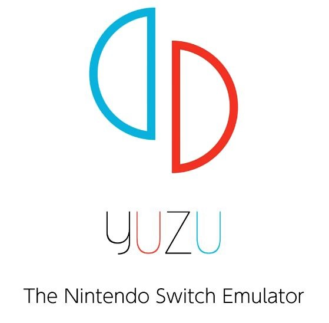
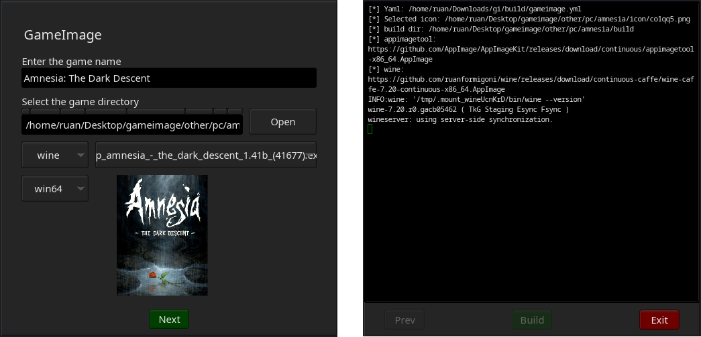

<div align="center">
  
</div>

# GameImage - AppImage Game Packer

- [GameImage - AppImage Game Packer](#gameimage---appimage-game-packer)
  - [Supported applications for packaging](#supported-applications-for-packaging)
  - [Showcase](#showcase)
  - [Graphical User Interface (GUI)](#graphical-user-interface-(gui))
  - [Build Dependencies](#build-dependencies)
  - [Install](#install)
  - [Usage (Command Line)](#usage-(command-line))
    - [Select Wine Distribution](#select-wine-distribution)
  - [Configuration](#configuration)
    - [Configure the emulator bundled inside the appimage](#configure-the-emulator-bundled-inside-the-appimage)
    - [Make the AppImage use the global configuration directory](#make-the-appimage-use-the-global-configuration-directory)
    - [Test the emulator inside the appimage](#test-the-emulator-inside-the-appimage)
  - [Examples](#examples)
  - [Tutorial on how to show icons for generated AppImages](#tutorial-on-how-to-show-icons-for-generated-appimages)

Game emulation is on the rise, with years of contribution from the community and
now with Valve's portable handheld, the `steam deck`. The fragmentation with
several platform emulators is daunting, especially since it requires repetitive
configuration for the first time or if the config files go missing. GameImage is
a tool to pack a runner (such as an emulator), a game, and it's configs in a
single `appimage` package.

Advantages:

- [x] Simplicity:
  - [x] No need to install an emulator or wine to run your games,
      they are downloaded as appimages and packaged with the game.
  - [x] Each game config/saves are in the same folder as the appimage by
      default (it can be changed to use global ~/.config). Which simplifies
      backups.
- [x] Usability: get your game running with a double click on a fresh linux
    install, no dependencies required.
- [x] Storage: Smaller file sizes than loose files, since appimage uses squashfs.


Also watch it on [youtube](https://www.youtube.com/watch?v=_15QkwCS7bg), thanks Not Aidan.

## Supported applications for packaging

<a href="https://www.retroarch.com/" target="_blank">
  
</a>

<a href="https://pcsx2.net/" target="_blank">

</a>

<a href="https://rpcs3.net/" target="_blank">

</a>

<a href="https://www.winehq.org/" target="_blank">

</a>

<a href="https://yuzu-emu.org/" target="_blank">

</a>

## Showcase

Files displayed on the `thunar` file manager.


## Graphical User Interface (GUI)



## Build Dependencies

Required packages to build:

For arch-based systems:
```
sudo pacman -S p7zip
```

For debian-based systems:
```
sudo add-apt-repository universe
sudo apt update
sudo apt install p7zip-full p7zip-rar
```

For Fedora:
```
sudo dnf install p7zip
sudo dnf install glibc.i686
```

For Vanilla OS:
```
sudo abroot exec apt install p7zip-full p7zip-rar libc6-i386
```

## Install

Download the appimage in the [releases](https://gitlab.com/formigoni/gameimage/-/releases) page.

## Usage (Command Line)

Gameimage requires a directory set-up with the required files for the target
platform, `./gameimage.AppImage` displays the following example:

```
-- Usage:
  main.sh --platform="target-platform" --name="game name" --dir=src-directory
  - "platform": [retroarch,pcsx2,rpcs3,yuzu,wine]
  - "name": The name of the game.
  - "dir": The directory with the bios, rom, etc. May be absolute or relative.
  The source directory must have this structure (files can have any name):
    src-directory
    ├─rom
    │ ├─rom-disc-1.[bin,cue,wbfs,...]
    │ ├─rom-disc-2.[bin,cue,wbfs,...]
    │ ├─...
    │ └─rom-disc-n.[bin,cue,wbfs,...]
    ├─core # for retroarch
    │ └─core.so
    ├─bios # for retroarch (psone), pcsx2, rpcs3
    │ └─bios.[bin,PUP]
    └─icon
      └─icon.[png,svg,jpg]
-- Usage:
  main.sh --version # Prints version and exits
```
### Select Wine Distribution

Default distribution is [wine-ge](https://github.com/ruanformigoni/wine). Available are:
* staging
* caffe
* vaniglia
* soda

To change it, export the variable before running the appimage, e.g:

```bash
export GIMG_WINE_DIST=soda
```


## Configuration

Consider an AppImage named `my-cool-game.AppImage`:

### Configure the emulator bundled inside the appimage

```
my-cool-game.AppImage --config
```

Change the `global` settings, and it will only apply to the game in the
`.AppImage`.

In the case of wine if you pass any parameters, they'll be executed as
`wine args...`

### Make the AppImage use the global configuration directory

Include an extra `.` in the extension to use `~/.config`:

From `my-cool-game.AppImage` to `my-cool-game..AppImage`

### Test the emulator inside the appimage

You can also pass any arguments to the emulator directly:

```
my-cool-game.AppImage -L "/path/to/my/core.so" "my-other-cool-rom"
```

---

## Examples

<details>
<summary>rpcs3 example</summary>

For `rpcs3` you can set up:

```
my-game-dir
├── bios
│   └── bios.PUP
├── icon
│   └── my-game-cover.png
└── rom
    ├── PS3_DISC.SFB
    └── PS3_GAME
```

and run:
```
gameimage.AppImage --platform=rpcs3 --name="My cool game" --dir=./my-game-dir
```
</details>

---

<details>
<summary>pcsx2 example</summary>

Similarly for `pcsx2`:

```
my-game-dir
├── bios
│   └── my-ripped-bios.bin
├── icon
│   └── my-game-cover.jpg
└── rom
    └── my-game.iso
```

and run:
```
./gameimage.AppImage --platform=pcsx2 --name="My cool game" --dir=./my-game-dir
```
</details>

---

<details>
<summary>retroarch example</summary>

For `retroarch`:

```
my-game-dir
├── bios
│   └── my-ripped-bios.bin
├── core
│   └── swanstation_libretro.so
├── icon
│   └── my-game-cover.png
└── rom
    ├── my-game-disc-1.bin
    ├── my-game-disc-1.cue
    ├── my-game-disc-2.bin
    ├── my-game-disc-2.cue
    ├── my-game-disc-3.bin
    ├── my-game-disc-3.cue
    ├── my-game-disc-4.bin
    └── my-game-disc-4.cue
```

and run:

```
./gameimage.AppImage --platform=retroarch --name="My cool game" --dir=./my-game-dir
```

This defaults the disc 1 to start with the appimage, you can open retroarch
interface with `F1` or other key you configured it with. And change discs in
there. Remove the `bios` folder for platforms that do not require it.
</details>

---

<details>
<summary>yuzu example with video</summary>

Video tutorial:


For `yuzu`:

```
my-game-dir
├── bios
│   └── my-firmware.[zip,7z]
├── keys
│   └── my-keys.[zip,7z]
├── icon
│   └── my-game-cover.png
├── rom
│   └── my-game.nsp
└── update # This folder is optional
    ├── my-dlc-1.nsp
    ├── my-dlc-2.nsp
    └── my-update.nsp
```

and run:

```
./gameimage.AppImage --platform=yuzu --name="My cool game" --dir=./my-game-dir
```

During the install, yuzu will open to install the updates in the `update`
folder.

</details>

---

<details>
<summary>wine example with video</summary>

Since version `0.2.0` the wine module works across several linux distros.

In the `winetricks` stage, some applications might require `dotnet45`

---

Video tutorial


---

Directory structure:

```
my-game-dir
├── icon
│   └── my-game-cover.png
└── rom
    ├── my-game-installer-1.bin
    ├── my-game-installer-2.bin
    ├── my-game-installer-3.bin
    └── my-game-installer.exe
```

and run:

```
./gameimage.AppImage --platform=wine --name="My cool game" --dir=./my-game-dir
```

During the installation, you will select the architecture (32 or 64) bit, and
use wine to install the desired game from it's gog's `.exe`, in the rom folder.
</details>

---

## Tutorial on how to show icons for generated AppImages

The following methods use thunar, other supported file managers are listed
<a href="https://github.com/linuxmint/xapp-thumbnailers" target="_blank">here</a>. Note that the `appimage` must be set as executable for the thumbnail generation.

<details>
<summary>Automatic Method</summary>
Execute the install script:

```sh
curl https://gitlab.com/formigoni/gameimage/-/raw/master/thumbnailer/install.sh | bash
```
</details>

<details>
<summary>Manual Method</summary>

1. Install the required packages
  - `sudo apt install tumbler squashfs-tools thunar`
  - `sudo pacman -S tumbler squashfs-tools thunar`

2. Copy the thumbnailer files
  - `sudo curl --output /usr/bin/thumbnailer-appimage https://gitlab.com/formigoni/gameimage/-/raw/master/thumbnailer/thumbnailer-appimage`
  - `sudo chmod +x /usr/bin/thumbnailer-appimage`
  - `mkdir -p ~/.local/share/thumbnailers`
  - `curl --output ~/.local/share/thumbnailers/appimage.thumbnailer https://gitlab.com/formigoni/gameimage/-/raw/master/thumbnailer/appimage.thumbnailer`

3. Allow icons on files over 2GB
  - `mkdir -p ~/.config/tumbler`
  - `cp /etc/xdg/tumbler/tumbler.rc ~/.config/tumbler/`
  - `awk -i inplace '/\[DesktopThumbnailer\]/,/MaxFileSize=(.*)/ { sub("MaxFileSize=.*", "MaxFileSize="); } 1' ~/.config/tumbler/tumbler.rc`

</details>

---

> Disclaimer: This project does not endorse piracy, buy your games and console
> to use this software.
